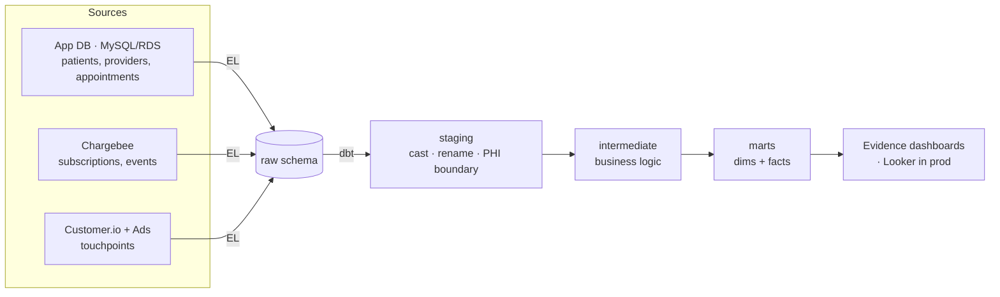

# Telehealth Analytics Pipeline

A small, scrappy-not-crappy analytics stack for a telehealth startup: raw
sources → warehouse → dbt models → BI, with data quality, source-freshness
monitoring, CI, and a scheduled incremental pipeline.

Runs **fully locally on DuckDB** (free, columnar, Redshift-shaped) with
**synthetic data** — no real PHI, no cloud account, no secrets. It's built to
lift to **Redshift Serverless + Airbyte + Looker** with a profile swap.

---

## Architecture



Two EL paths — pick the one that fits your workflow:

| Path | When to use | Mechanism |
|---|---|---|
| `python load.py` | CI, Pages deploy, first-time setup | Full-refresh CSVs → DuckDB |
| `python extract/pipeline.py` | Local dev, daily increment, testing incremental | dlt (incremental merge/append, three sync strategies) |

Both write into the same `dashboards/sources/telehealth/telehealth.duckdb` and
leave `raw` in the same schema, so dbt doesn't care which one populated it.
In production the same dlt pipeline lands into Redshift via a destination swap.
Everything to the right of `raw` is identical regardless of the EL path.

---

## Modeling layers

| Layer | Materialization | Purpose |
|---|---|---|
| `staging` | view | 1:1 with sources; cast, rename, light cleaning. **PHI stops here.** |
| `intermediate` | ephemeral | Reusable business logic (joins, attribution, tenure). |
| `marts` | table | What BI reads. Dimensions + facts, one file per grain. |

Each mart maps to a team's questions:

| Team | Mart | Answers |
|---|---|---|
| Medical Ops | `fct_appointments` | No-show rate, appointment volume, provider load, lead times |
| Business Ops | `fct_mrr_daily`, `fct_subscriptions` | MRR / ARR / ARPU over time, plan mix, cohorts, churn |
| Marketing | `mart_marketing_attribution` | Signups + CAC by channel/campaign, active MRR by channel |
| Shared | `dim_patients`, `dim_providers` | Conformed dimensions (patient PHI-minimised) |

---

## Slowly Changing Dimensions: subscription plan history

Subscriptions change plan over time (upgrade / downgrade). To answer
point-in-time questions — *what plan was this subscription on last month?*,
*how did revenue split across plans over time?* — the current-state
`fct_subscriptions` isn't enough; you need history. This project ships **both
tools for capturing it**, because they suit different source shapes:

| | `snapshots/subscriptions_snapshot.sql` | `dim_subscription_history` |
|---|---|---|
| Mechanism | dbt snapshot (SCD2) | SQL reconstruction from the event log |
| Source | current-state table (overwrites in place) | `subscription_events` |
| History | accrues **going forward**, run over run | **complete immediately**, one build |
| Use when | source keeps no history (e.g. a patient's address) | you have a reliable change log |

**Why two?** Real sources come in both shapes, and Chargebee gives you both a
current-state subscription object *and* an events stream. The rule of thumb:

- If the source only ever shows you *current* state and overwrites it, you can't
  recover the past — so you **snapshot** it on a schedule to capture changes as
  they happen. That's `subscriptions_snapshot`.
- If the source already emits a full **change log**, don't bother snapshotting —
  fold the events into SCD2 directly and you get complete history in one pass.
  That's `dim_subscription_history` (built with window functions over
  `subscription_events`).

A concrete gotcha this repo makes visible: `generate_data.py day` appends to
`subscription_events` but doesn't rewrite existing rows' plan in
`subscriptions.csv`. So the **snapshot alone would miss those plan changes** —
which is exactly the situation where event-reconstruction is the right call. The
snapshot is kept as the pattern you'd use elsewhere.

### `dim_subscription_history` grain

One row per `(subscription_id, plan period)`, with `valid_from`, `valid_to`
(NULL = current), `is_current`, and `version`. Periods are contiguous and
non-overlapping; every active subscription has exactly one current row, and
cancelled subscriptions have none (their final period closes at cancellation).

```sql
-- what plan was every subscription on at a given date?
select subscription_id, plan_id, mrr_amount
from marts.dim_subscription_history
where valid_from <= date '2024-11-15'
  and (valid_to > date '2024-11-15' or valid_to is null);
```

### Running

`dim_subscription_history` is a normal model — `dbt build` picks it up. The
snapshot runs as part of `dbt build` too (or on its own):

```bash
dbt snapshot          # capture current state into the snapshots schema
dbt build             # builds models + snapshots + tests together
```

> To surface the history in Evidence, add a pass-through in
> `dashboards/sources/telehealth/` (`select * from marts.dim_subscription_history`)
> and a page charting plan mix over time — the data is deterministic, so it
> renders on the deployed site.

---

## PHI handling

Telehealth data is PHI. Two deliberate choices:

1. **Synthetic only.** Real patient data never enters dev or CI. `generate_data.py`
   fabricates everything. The committed fixture (`data/raw/`) is generated with a
   fixed seed for byte-level reproducibility:

   ```bash
   python generate_data.py backfill --start 2024-10-01 --end 2024-12-31 \
       --seed 42 --output-dir data/raw
   ```
2. **A PHI boundary at staging.** Direct identifiers (email, name, DOB) live
   **only** in `stg_patients`. Marts expose `age_band` instead of DOB, an
   `email_hash` join key instead of the address, and never carry names. See the
   header comment in `models/staging/stg_patients.sql`.

In production this extends to: restricted schema grants on staging, no PII in
logs, and row/column controls in Looker.

---

## Quickstart

Requires Python 3.12+.

```bash
pip install -r requirements.txt
dbt deps
python load.py                          # CSV → DuckDB raw schema
dbt build                               # staging → intermediate → marts
```

Or with `make` (Unix/macOS):

```bash
make all          # same four steps in one command
make docs         # browse the lineage graph + docs at localhost:8080
```

Query the result:

```bash
python -c "import duckdb; duckdb.connect('dashboards/sources/telehealth/telehealth.duckdb').sql(\"select calendar_date, active_subscriptions, mrr from marts.fct_mrr_daily order by calendar_date desc limit 7\").show()"
```

### Two data paths

- **Fixture** (`data/raw/`, committed, deterministic): the default. `python load.py`,
  CI, and the Pages deploy all build from this so results are reproducible.
- **Generated** (`data/generated/`, gitignored, large): for local scale testing.
  `python generate_data.py backfill --start 2024-01-01 --end 2024-06-30 --output-dir data/generated`
  seeds it, then `python load.py --data-dir data/generated` builds from it.
  (`make generate-big` / `make load-big` on Unix.)

### Simulate the scheduled increment

```bash
python generate_data.py backfill --start 2024-01-01 --end 2024-06-30 --output-dir data/generated
python generate_data.py day 2025-01-02 data/generated
python load.py --data-dir data/generated --db dashboards/sources/telehealth/telehealth.duckdb
dbt build
```

(`make generate-big && make day D=2025-01-02` on Unix.)

---

## Automation

All CI paths build from the committed fixture — deterministic, hermetic, no
secrets, no cache.

- **`.github/workflows/ci.yml`** — on every PR: `dbt build --fail-fast` against
  the fixture. Guards against shipping a broken transform.
- **`.github/workflows/deploy-dashboards.yml`** — on push to `main`: full
  pipeline (load fixture → dbt build → stage warehouse → evidence build) →
  publishes the Evidence site to GitHub Pages. Enable once under Settings →
  Pages → Source = "GitHub Actions". Live at `https://<user>.github.io/<repo>/`.
- **`.github/workflows/scheduled_pipeline.yml`** *(optional demo)* — daily cron
  that appends a day and rebuilds incrementally. This is the only path that
  caches the DuckDB file (to carry incremental state across runs); the core
  build/deploy paths deliberately don't.

Monitoring is deliberately scrappy: source freshness + test failures + an
optional Slack ping cover the failure modes that matter at this scale, with zero
extra infra.

## Dashboards (Evidence)

A code-based BI layer in `dashboards/` — SQL + Markdown, version-controlled,
builds to a static site. Chosen over a GUI tool (Metabase/Looker) for the demo
because the dashboards live in the repo as code and deploy free to GitHub Pages,
so the project has a clickable front door without anyone running a server.

Four pages, mapped to the same teams as the marts:

| Page | For | Shows |
|---|---|---|
| `index` | Leadership | MRR / subscribers / patients / no-show KPIs, revenue trend, acquisition mix |
| `medical-ops` | Medical Ops | Weekly volume + no-show trend, no-show by specialty, visit-type mix, provider load |
| `business-ops` | Business Ops | MRR/ARR trend, plan mix, subscriber cohorts (retained vs. churned) |
| `marketing` | Marketing | Signups + CAC by channel, cost-vs-conversion scatter, campaign detail |

Run locally (needs Node 18+; build the warehouse first):

```bash
cd dashboards
npm install
npm run sources          # introspect DuckDB schema for Evidence
npm run dev              # dev server at localhost:3000
```

(`make dash` on Unix — same four commands bundled.)

**Live deploy.** `.github/workflows/deploy-dashboards.yml` runs the full pipeline
and publishes to GitHub Pages on push to `main` (see Automation above).

> Evidence moves fast. The deploy workflow uses `yq` to inject
> `deployment.basePath` into `evidence.config.yaml` before building (env vars
> like `BASE_PATH` are ignored in Evidence ≥v40). If assets 404 on deploy, check
> whether Evidence's config schema has changed — that injection is the
> version-sensitive bit.

---

## Path to production

| Concern | Here (demo) | Production |
|---|---|---|
| Warehouse | DuckDB file | Redshift Serverless (uncomment `prod` in `profiles.yml`) |
| EL | `load.py` (fixture) or `extract/pipeline.py` (dlt) | dlt / Airbyte connectors → `raw` |
| BI | Evidence (static site) | Looker (LookML on the marts); Evidence still fine for exec/embedded |
| Orchestration | GitHub Actions cron | Same, or Dagster if DAG complexity grows |
| Incrementality | one file, DuckDB | same models; add dist/sort keys on `fct_appointments` |

The SQL is written to be portable; the move is a profile swap plus physical
tuning (dist/sort keys, `all_varchar` raw pattern already assumed) on the
largest facts.

---

## Repo layout

```
├── extract/                  # dlt EL layer (incremental, three sync strategies)
│   ├── pipeline.py           #   dlt resources: replace / merge / append
│   ├── source_db.py          #   build simulated source systems from CSVs
│   └── README.md             #   sync-strategy design doc
├── generate_data.py          # synthetic data (stdlib only): backfill + daily append
├── load.py                   # CSV -> DuckDB raw schema (deterministic, CI uses this)
├── dbt_project.yml           # layer configs, vars
├── profiles.yml              # duckdb dev/ci; commented redshift prod
├── packages.yml              # dbt_utils
├── Makefile                  # one-command ergonomics
├── data/raw/*.csv            # committed sample fixture (deterministic, seed=42)
├── data/generated/           # large synthetic sets (gitignored, local dev)
├── macros/
│   └── generate_schema_name.sql
└── models/
    ├── staging/              # stg_* + _sources.yml (freshness) + tests
    ├── intermediate/         # int_appointments / subscriptions / attribution
    └── marts/
        ├── core/             # dim_patients, dim_providers, fct_appointments,
        │                     #   fct_mrr_daily, fct_subscriptions
        └── marketing/        # mart_marketing_attribution

dashboards/                   # Evidence BI project (code-based, deploys to Pages)
├── pages/                    # index, medical-ops, business-ops, marketing (.md)
├── sources/telehealth/       # DuckDB connection + pass-through queries on marts
├── evidence.config.yaml
└── package.json
```

> Synthetic data for demonstration. Not for use with real patient records.
