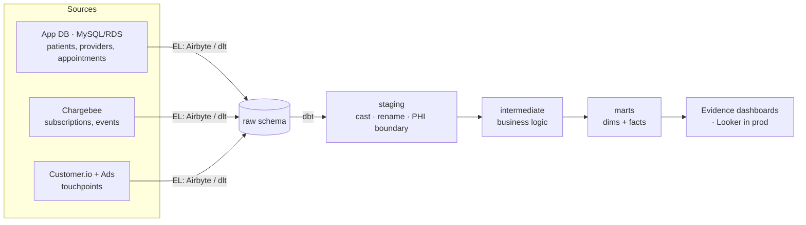

# Telehealth Analytics Pipeline

A small, scrappy-not-crappy analytics stack for a telehealth startup: raw
sources → warehouse → dbt models → BI, with data quality, source-freshness
monitoring, CI, and a scheduled incremental pipeline.

Runs **fully locally on DuckDB** (free, columnar, Redshift-shaped) with
**synthetic data** — no real PHI, no cloud account, no secrets. It's built to
lift to **Redshift Serverless + Airbyte + Looker** with a profile swap.

---

## Architecture



Locally the EL step is `load.py` landing CSVs into DuckDB; in production it's
Airbyte/dlt landing into Redshift. Everything to the right of `raw` is identical.
The Evidence layer (`dashboards/`) reads the same marts and builds a static site.

---

## Modeling layers

| Layer | Materialization | Purpose |
|---|---|---|
| `staging` | view | 1:1 with sources; cast, rename, light cleaning. **PHI stops here.** |
| `intermediate` | ephemeral | Reusable business logic (joins, attribution, tenure). |
| `marts` | table | What BI reads. Dimensions + facts, one file per grain. |

Each mart maps to a team's questions:

| Team | Mart | Answers |
|---|---|---|
| Medical Ops | `fct_appointments` | No-show rate, appointment volume, provider load, lead times |
| Business Ops | `fct_mrr_daily`, `fct_subscriptions` | MRR / ARR / ARPU over time, plan mix, cohorts, churn |
| Marketing | `mart_marketing_attribution` | Signups + CAC by channel/campaign, active MRR by channel |
| Shared | `dim_patients`, `dim_providers` | Conformed dimensions (patient PHI-minimised) |

---

## PHI handling

Telehealth data is PHI. Two deliberate choices:

1. **Synthetic only.** Real patient data never enters dev or CI. `generate_data.py`
   fabricates everything. The committed fixture (`data/raw/`) is generated with a
   fixed seed for byte-level reproducibility:

   ```bash
   python generate_data.py backfill --start 2024-10-01 --end 2024-12-31 \
       --seed 42 --output-dir data/raw
   ```
2. **A PHI boundary at staging.** Direct identifiers (email, name, DOB) live
   **only** in `stg_patients`. Marts expose `age_band` instead of DOB, an
   `email_hash` join key instead of the address, and never carry names. See the
   header comment in `models/staging/stg_patients.sql`.

In production this extends to: restricted schema grants on staging, no PII in
logs, and row/column controls in Looker.

---

## Quickstart

Requires Python 3.12+.

```bash
make all          # setup -> load fixture -> build
make docs         # browse the lineage graph + docs at localhost:8080
```

Or step by step (the fixture is committed, so there's nothing to generate):

```bash
pip install -r requirements.txt
dbt deps
python load.py          # loads the committed fixture from data/raw
dbt build               # runs + tests every model
```

Query the result:

```bash
duckdb telehealth.duckdb "select calendar_date, active_subscriptions, mrr
                          from marts.fct_mrr_daily order by calendar_date desc limit 7;"
```

### Two data paths

- **Fixture** (`data/raw/`, committed, deterministic): the default. `make load`,
  CI, and the Pages deploy all build from this so results are reproducible.
- **Generated** (`data/generated/`, gitignored, large): for local scale testing.
  `make generate-big` seeds it, `make load-big` builds from it.

### Simulate the scheduled increment

```bash
make generate-big        # seed data/generated first
make day D=2025-01-02     # append one day to data/generated, reload, rebuild
```

`make day` targets `data/generated` (never the committed fixture), so it won't
create git churn.

---

## Automation

All CI paths build from the committed fixture — deterministic, hermetic, no
secrets, no cache.

- **`.github/workflows/ci.yml`** — on every PR: `dbt build --fail-fast` against
  the fixture. Guards against shipping a broken transform.
- **`.github/workflows/deploy-dashboards.yml`** — on push to `main`: full
  pipeline (load fixture → dbt build → stage warehouse → evidence build) →
  publishes the Evidence site to GitHub Pages. Enable once under Settings →
  Pages → Source = "GitHub Actions". Live at `https://<user>.github.io/<repo>/`.
- **`.github/workflows/scheduled_pipeline.yml`** *(optional demo)* — daily cron
  that appends a day and rebuilds incrementally. This is the only path that
  caches the DuckDB file (to carry incremental state across runs); the core
  build/deploy paths deliberately don't.

Monitoring is deliberately scrappy: source freshness + test failures + an
optional Slack ping cover the failure modes that matter at this scale, with zero
extra infra.

## Dashboards (Evidence)

A code-based BI layer in `dashboards/` — SQL + Markdown, version-controlled,
builds to a static site. Chosen over a GUI tool (Metabase/Looker) for the demo
because the dashboards live in the repo as code and deploy free to GitHub Pages,
so the project has a clickable front door without anyone running a server.

Four pages, mapped to the same teams as the marts:

| Page | For | Shows |
|---|---|---|
| `index` | Leadership | MRR / subscribers / patients / no-show KPIs, revenue trend, acquisition mix |
| `medical-ops` | Medical Ops | Weekly volume + no-show trend, no-show by specialty, visit-type mix, provider load |
| `business-ops` | Business Ops | MRR/ARR trend, plan mix, subscriber cohorts (retained vs. churned) |
| `marketing` | Marketing | Signups + CAC by channel, cost-vs-conversion scatter, campaign detail |

Run locally (needs Node 18+; build the warehouse first):

```bash
make all          # build warehouse at dashboards/sources/telehealth/telehealth.duckdb
make dash         # install + run Evidence at localhost:3000
```

**Live deploy.** `.github/workflows/deploy-dashboards.yml` runs the full pipeline
and publishes to GitHub Pages on push to `main` (see Automation above).

> Evidence moves fast. The deploy workflow uses `yq` to inject
> `deployment.basePath` into `evidence.config.yaml` before building (env vars
> like `BASE_PATH` are ignored in Evidence ≥v40). If assets 404 on deploy, check
> whether Evidence's config schema has changed — that injection is the
> version-sensitive bit.

---

## Path to production

| Concern | Here (demo) | Production |
|---|---|---|
| Warehouse | DuckDB file | Redshift Serverless (uncomment `prod` in `profiles.yml`) |
| EL | `load.py` on CSVs | Airbyte / dlt connectors → `raw` |
| BI | Evidence (static site) | Looker (LookML on the marts); Evidence still fine for exec/embedded |
| Orchestration | GitHub Actions cron | Same, or Dagster if DAG complexity grows |
| Incrementality | one file, DuckDB | same models; add dist/sort keys on `fct_appointments` |

The SQL is written to be portable; the move is a profile swap plus physical
tuning (dist/sort keys, `all_varchar` raw pattern already assumed) on the
largest facts.

---

## Repo layout

```
├── generate_data.py          # synthetic data (stdlib only): backfill + daily append
├── load.py                   # CSV -> DuckDB raw schema
├── dbt_project.yml           # layer configs, vars
├── profiles.yml              # duckdb dev/ci; commented redshift prod
├── packages.yml              # dbt_utils
├── Makefile                  # one-command ergonomics
├── data/raw/*.csv            # committed sample fixture (deterministic, seed=42)
├── data/generated/           # large synthetic sets (gitignored, local dev)
├── macros/
│   └── generate_schema_name.sql
└── models/
    ├── staging/              # stg_* + _sources.yml (freshness) + tests
    ├── intermediate/         # int_appointments / subscriptions / attribution
    └── marts/
        ├── core/             # dim_patients, dim_providers, fct_appointments,
        │                     #   fct_mrr_daily, fct_subscriptions
        └── marketing/        # mart_marketing_attribution

dashboards/                   # Evidence BI project (code-based, deploys to Pages)
├── pages/                    # index, medical-ops, business-ops, marketing (.md)
├── sources/telehealth/       # DuckDB connection + pass-through queries on marts
├── evidence.config.yaml
└── package.json
```

> Synthetic data for demonstration. Not for use with real patient records.
